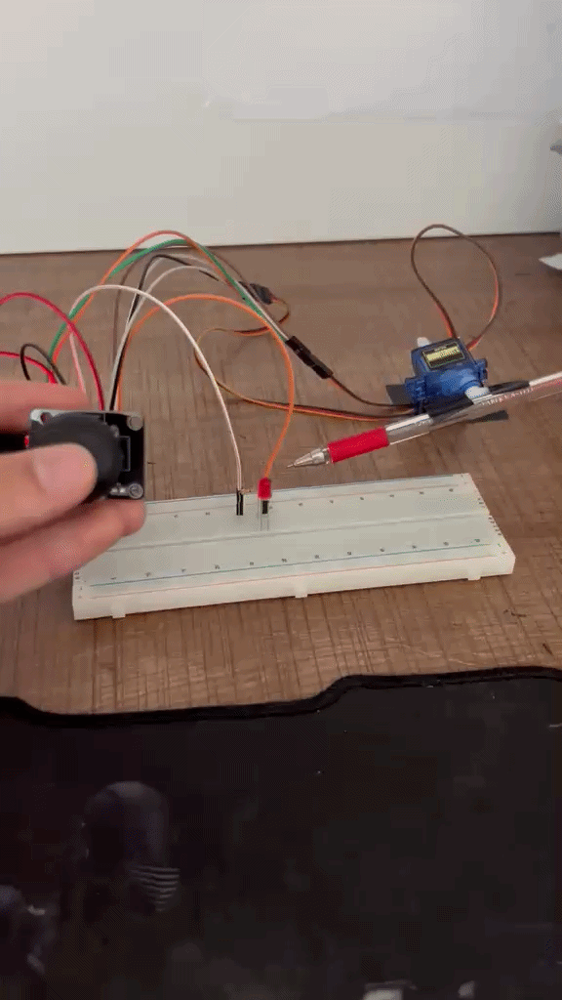

# Dual-Axis-Servo-Control-with-Joystick
Real-time control of two servo motors using analog joystick inputs, featuring a button-activated indicator LED.

---
## Demo

---
## How It Works
The system interfaces with a dual-axis analog joystick and two standard servo motors. The joystick's **X** and **Y** potentiometers output variable analog voltages, which the Arduino samples via `analogRead()` as integers between `0` and `1023`.
Inside the execution `loop()`:
* The raw inputs are scaled to an angular range of 0 to 180 degrees using a floating-point linear equation: `(180 / 1023.) * xVal`.
* The calculated positions are directly transmitted to the hardware using `xServo.write()` and `yServo.write()`.
* The joystick's integrated click-switch is read via `digitalRead()`. A `LOW` (`0`) state triggers `ledPin` to `HIGH`, illuminating the indicator.

---
 ## Components
 * Arduino Uno
 * 1x Joystick Module (x,y,sw)
 * 2x SG90 Servo Motors (or similar standard servos)
 * 1x LED
 * Bread Board + Jumper Wires

---
## Concepts Covered
* **Analog-to-Digital Conversion (ADC)**: Reading continuously variable voltage signals from dual potentiometers using analog input pins.

* **Linear Data Scaling**: Manually converting numeric ranges using custom floating-point mathematical expressions instead of built-in functions.

* **Pulse Position Modulation (PPM):** Controlling the angular shaft placement of servo motors using the `Servo.h` library.

* **Multi-Input Integration:** Concurrently processing distinct analog and digital tracking inputs within a single non-blocking execution block.

---
## Skills
`Arduino` `C++` `Analog Input` `Embedded Systems`
